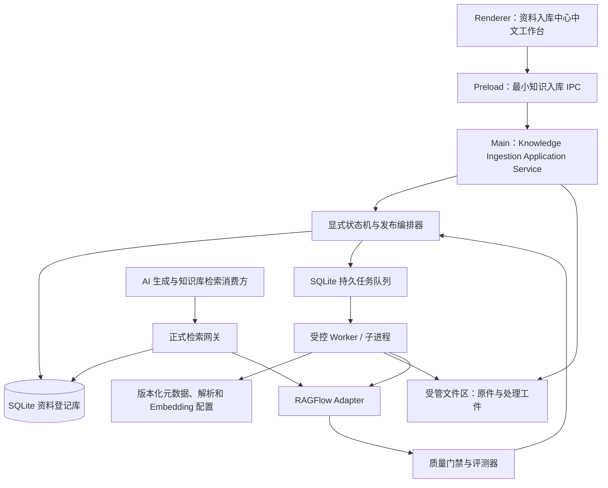
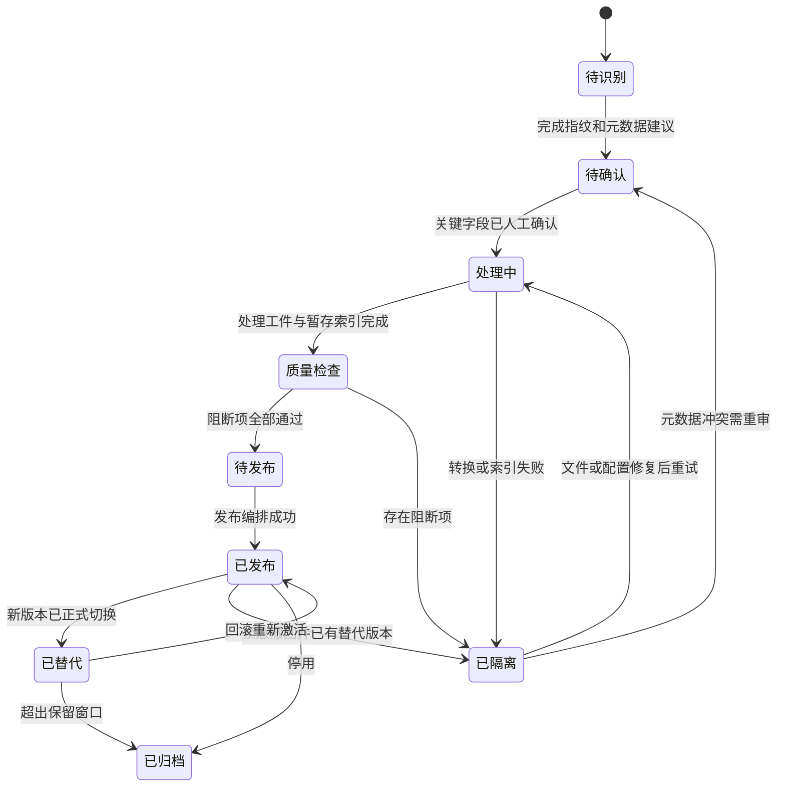

# RAGFLOW_input 完整开发方案

> 版本：V1.2
> 编制日期：2026-07-11
> 当前状态：阶段 0 `PH3-13A`、阶段 1 `PH3-13B`，以及阶段 2 的 `PH3-13C1`、`PH3-13C2`、`PH3-13C2A`、`PH3-13C3` 已完成；`PH3-13C4-publication-rollback-v1` 本地闭环已完成、真实远端 smoke 待确认
> 方案记录：`PH3-12-ragflow-input-lifecycle-design-v1`  
> 实施任务：`PH3-13 资料入库中心与资料生命周期治理`

> C4 当前只实现单文件同分支发布、替代、上一版本回滚与窄用途 `publication_compensation`；生产 active 检索网关、通用 outbox、归档删除和跨索引代次治理仍归属 `PH3-13H/J`。未再次展示并确认明确暂存数据集前，不执行真实 RAGFlow 发布、回滚或 smoke。

## 1. 核心结论

RAGFLOW_input 不能继续建设成“把现有资料清洗一次，再上传一个新知识库”的临时项目。正确产品形态是由 Layout3 提供长期运行的“资料入库中心”，让历史资料迁移和未来日常新增只在接收方式上不同，进入登记库以后必须执行完全相同的状态机、处理器、质量门禁、发布和回滚逻辑。

最终职责固定为：

| 系统 | 真相范围 | 结论 |
|---|---|---|
| `.layout + LayoutDocument` | 用户正在创作和排版的文档 | 继续作为创作文档真相源，不承载资料库生命周期 |
| Layout3 SQLite 登记库 | 资料身份、版本、状态、元数据、处理记录、质量结果、发布关系 | 资料治理唯一业务真相源 |
| Layout3 受管文件区 | 原始文件不可变副本、转换产物、OCR/ASR 文本、拆分产物 | 可追溯资料资产存储 |
| RAGFlow | 切片、向量和检索服务 | 可重建的检索投影，不作为资料业务真相源 |
| `progress/` | 项目任务、风险和开发日志 | 项目推进真相源，不保存业务资料 |

必须同时满足六条硬约束：

1. Layout3 的“资料入库中心”是唯一受支持的上传和批量导入入口；RAGFlow 后台只供管理员排障。
2. 完全重复、新版本、近似重复、异常文件都先登记，再由统一规则决定跳过、确认、处理或隔离。
3. 所有新索引先写入 `status=pending`，质量通过后才进入正式发布。
4. 正式检索由 Main 根据 SQLite 当前有效发布关系生成精确 active `document_ids`，让 RAGFlow 在排序前按这组 ID 过滤；允许集合为空时在本地直接返回无结果，返回后再按 SQLite 二次校验。RAGFlow `status` metadata 只用于审计、漂移和升级复测，不作为 0.25.0 的联合安全门。
5. 新版本处理和评测期间旧版本持续可用；发布失败不能影响旧版本；发布后可立即回滚。
6. 大模型只提供元数据建议和冒烟问题候选，不能直接决定关键元数据、资料状态和发布动作。

## 2. 为什么必须这样设计

### 2.1 一次性清洗会形成两条不可控链路

如果现有资料使用脚本清洗，而未来资料继续从 RAGFlow 后台直接上传，会逐渐出现以下问题：

- 历史资料有清单和校验和，新增资料没有。
- 旧资料经过元数据治理，新增资料仍依赖文件名和人工记忆。
- 一部分资料经过影子库评测，另一部分直接进入生产检索。
- 同一资料的新版本无法和旧版本建立稳定关系。
- 发生错误召回时，无法从片段追溯到统一登记记录、源文件和处理参数。
- 模型或切片规则升级后，无法确认哪些资料需要重建以及如何回滚。

因此，历史资料清洗只能是统一入库系统的“迁移接收适配器”，不能成为第二套业务流程。

### 2.2 SQLite 与 RAGFlow 不能互相替代

RAGFlow 擅长解析、切片、向量化和检索，但它的文档 ID、数据集和解析状态不是 Layout3 的稳定业务身份。资料在 RAGFlow 中删除、重建或迁移后，远端 ID 可能变化；版本、人工确认、发布审计和跨索引回滚也不能只靠 RAGFlow 内部状态表达。

SQLite 负责稳定业务身份和事务，RAGFlow 负责可重建索引。两者通过 `ragflow_dataset_id + ragflow_document_id` 映射，而不是把 RAGFlow ID 写进 `canonical_id`。

### 2.3 “原子发布”必须由 Layout3 检索网关实现

SQLite 事务不能和 RAGFlow HTTP 操作组成一个真正的跨系统数据库事务。因此不能简单承诺“连续修改两份 RAGFlow 文档元数据就是原子切换”。

本方案的逻辑原子性有一个不可省略的前置条件：正式检索必须由 Main 把 SQLite 当前有效发布关系中的精确 `ragflow_document_id` 集合放进 RAGFlow 请求，让远端在 `top_k/page_size` 排序前执行 document 过滤。允许集合为空时必须在本地失败关闭；SQLite 后置校验只作为二次防御，不能单独承担发布原子性，否则新旧版本并存窗口会互相挤占有限候选，后置过滤后可能变成零结果。阶段 0 已确认 RAGFlow 0.25.0 在 `document_ids` 非空时会忽略 `status` metadata，因此正式安全合同不能依赖二者求交。

发布采用以下顺序：

1. 新版本在 RAGFlow 完成 `pending` 索引并通过隔离质量检索。
2. 准备新的 SQLite 发布关系，但正式检索仍向 RAGFlow 传入旧版本的精确 `document_ids`。
3. 把新版本远端元数据改为 `active` 并回读留作审计，再通过限定新 `document_ids` 的预发布检查核验；远端 status 变化不产生正式可见性，旧版本仍服务正式请求。
4. 在一个 SQLite 事务内切换对应发布分支的有效关系和发布代次；这是正式检索的唯一可见切换点。
5. 下一次正式请求只把新版本 `document_ids` 传给 RAGFlow，旧版本即使远端暂时仍为 active，也不会进入远端候选池。
6. outbox 异步把同一发布分支的旧版本改为 `superseded`，并持续重试未完成补偿。

阶段 0 已真实验证当前 RAGFlow 0.25.0 对 retrieval `document_ids` 的非空、伪造 ID 拒绝和排序前过滤行为，并确认精确 ID 前置过滤可用；同时确认 `document_ids + status` 联合合同不成立。用户已确认采用路线 A：由 SQLite 当前有效发布关系生成精确 active ID 集合，Main 负责失败关闭和返回后二次校验。若未来版本通过联合合同复测，可把 `status=active` 恢复为额外防御，但不能替代精确 ID 集合；若 `document_ids` 前置过滤本身失效，则必须改用物理 staging/live 数据集代次隔离，禁止退化成宽召回后过滤。

## 3. 目标与边界

### 3.1 产品目标

- 建立单文件、文件夹和 CSV/Excel 清单三种统一入库方式。
- 建立资料登记、精确去重、版本识别、近似重复复核和来源追踪。
- 建立有证据、有置信度、可人工确认的元数据建议体系。
- 建立转换、OCR、ASR、逻辑拆分、解析模板路由和暂存索引。
- 建立自动质量检查、单资料冒烟、批量回归和发布门禁。
- 建立增量发布、版本替代、回滚、归档、删除和蓝绿索引切换。
- 建立检索监控、错误反馈、健康指标和定期复查。
- 让已有英语、会计资料最终通过同一流水线完成登记和迁移。

### 3.2 本方案明确不改变

- 不改变 `.layout` 和 `LayoutDocument` 的创作文档真相源地位。
- 不把知识资料登记字段塞进排版文档模型。
- 不重做分页算法、画布渲染、PDF/DOCX 导出和模板系统。
- 不让 RAGFlow 后台成为面向日常用户的第二个上传入口。
- 不允许大模型自动确认学科、教材版本、单元、年份、有效期或发布状态。
- 不在本方案编制步骤中安装依赖、创建 SQLite、改应用代码或操作生产知识库。

### 3.3 与现有 PH3-12 的关系

`PH3-12` 已完成或正在进行的以下成果继续保留：

- 生产资料只读快照、远端大小和 SHA-256 审计。
- 英语库 22 份旧 `.doc` 到 `.docx` 的不覆盖转换和验证。
- 8 个可靠来源形成的 56 个受控单元副本，以及汇总完成的 127 份影子语料清单和哈希核验。
- 元数据确定性规则、dry-run、人工复核清单和远端核验思路。
- RAGFlow 检索参数、应用侧阈值、近重复过滤、同文档配额和 10 条评测基线。
- 英语影子库与生产库对照评测的安全原则。

在本方案编制期间，基于此前已确认边界执行的独立英语影子库已经创建并完成 127 份副本上传；当前 127 份全部为 `UNSTART`、切片总数为 0，尚未解析、评测或发布，并已冻结。它只能作为待接管的 `legacy_staging` 远端工件，不能因为“已经上传”就跳过 SQLite 登记、质量门禁和发布控制。

这些成果将作为“历史资料首批迁移”的输入工件和验证基线。后续不再继续建设只服务于英语资料的一次性拆分、上传和发布旁路。

## 4. 完整生命周期


所有入口只负责形成 `intake_batch + intake_item`，从“资料登记”开始共用同一条应用服务：

```text
单文件上传 ─┐
文件夹导入 ─┼─> IntakeService.receive() ─> 统一登记、状态机和任务队列
清单导入   ─┤
历史迁移   ─┘
```

未来的“监控文件夹自动同步”只增加一个接收适配器，不能绕过人工确认和质量门禁。

## 5. 总体架构



### 5.1 进程职责

| 层 | 允许职责 | 禁止职责 |
|---|---|---|
| Renderer | 中文界面、筛选、选择、表单、进度展示、人工确认 | 直接读写 SQLite、直接访问文件系统、保存 RAGFlow 密钥、直接上传 RAGFlow |
| Preload | 暴露经过类型约束的最小 IPC | 暴露 Node API、数据库连接或任意 HTTP 请求 |
| Electron Main | 路径校验、登记事务、任务编排、RAGFlow 客户端、发布和回滚 | 在事件循环里同步执行 OCR、ASR、大文件哈希和长时间转换 |
| Worker/子进程 | 流式哈希、转换、OCR、ASR、正文抽取、逻辑拆分 | 直接决定发布状态或绕过 SQLite 更新业务状态 |
| SQLite | 业务身份、状态、版本、审计、发布代次、任务恢复 | 保存大体积二进制正文 |
| RAGFlow | 暂存/生产索引、切片、向量和检索 | 决定业务当前版本和人工确认结果 |

### 5.2 建议本地数据目录

```text
app.getPath('userData')/knowledge-ingestion/
├── registry.sqlite
├── backups/
├── objects/
│   └── sha256前两位/完整sha256.扩展名
├── artifacts/
│   └── version_id/
│       ├── extracted/
│       ├── converted/
│       ├── ocr/
│       ├── asr/
│       ├── logical-documents/
│       └── manifests/
├── quarantine/
└── logs/
```

原始文件进入受管区后按内容哈希保存不可变副本；`source_path` 只记录用户原位置，不能把它当作唯一可恢复来源。大体积资料和本地数据库全部禁止进入 Git。

## 6. 资料身份、版本和状态

### 6.1 三类身份不能混用

| 字段 | 含义 | 生成规则 |
|---|---|---|
| `canonical_id` | 跨版本不变的资料业务身份 | Layout3 首次确认资料身份时生成，例如 `mat_<uuid>`；不包含 RAGFlow ID |
| `publication_branch_key` | 同一资料允许并存的发布分支 | 由 edition、curriculum_year、法规系列/适用范围等受控字段归一生成 |
| `version_id` | 某一次内容版本的内部身份 | 每个新内容版本独立生成 |
| `content_hash` | 原始文件字节的 SHA-256 | 流式计算；完全相同即全局重复 |
| `ragflow_document_id` | 某次索引投影的远端身份 | 由 RAGFlow 返回，可删除和重建 |

同一 `content_hash` 再次导入时不创建第二份内容版本，而是追加一条来源记录并返回“完全重复，已跳过”。同一 `canonical_id` 出现不同 `content_hash` 时创建递增 `version_no`。标题相似但身份不确定时只生成候选冲突，不自动合并。

`canonical_id` 表示逻辑资料身份，不等于“全局只能发布一个版本”。教材版次和课程年份形成不同 `publication_branch_key`，可以同时拥有有效发布关系；同一分支内的新修订才替代旧修订。法规类版本在分支内使用 `effective_from/effective_to` 形成不重叠的有效区间，查询默认选择指定日期有效的版本。没有显式版次条件时，网关按受控默认策略选择当前教材分支，不能简单取全 canonical 的最大 `version_no`。

### 6.2 状态需要拆成三个维度

当前治理脚本中的 `ready/quarantine/unparsed/parse_failed` 表示解析健康状态，不能继续同时承担工作流和发布状态。新模型拆分为：

1. `workflow_status`：用户看到的完整生命周期。
2. `processing_health`：转换、抽取、OCR、ASR 和解析是否健康。
3. `index_publication_status`：写入 RAGFlow 的 `pending/active/superseded/archived`。

`workflow_status` 允许值：

```text
待识别 → 待确认 → 处理中 → 质量检查 → 待发布 → 已发布
                         └──────────────→ 已隔离
已发布 → 已替代
已发布 → 已隔离（紧急撤回或回滚，且同事务已有另一有效发布）
已替代 → 已发布（回滚时与当前版本成对切换）
已发布 / 已替代 → 已归档
已隔离 → 待确认 / 处理中（问题修复后显式重试）
```



任何状态变化都必须由状态机校验前置条件，并追加不可覆盖的状态事件。回滚必须在同一个 SQLite 事务里把目标旧版本从“已替代”恢复为“已发布”，同时把当前问题版本从“已发布”改为“已替代”或业务“已隔离”；只有另一有效发布关系已经在同一事务建立时，才允许直接执行“已发布 → 已隔离”，避免形成无可用版本。远端仍只使用 `pending/active/superseded/archived`：从未发布的隔离资料保持 `pending` 或在放弃后 `archived`；已发布后因质量问题回滚的版本使用 `superseded`，不能写入未定义的远端 `quarantine`。UI 不允许直接提交任意目标状态。

## 7. SQLite 资料登记库

### 7.1 技术选择

建议在 Electron 主进程使用 `better-sqlite3`，原因是事务和迁移简单、读取稳定、适合单机桌面应用。由于它是原生模块，正式采用前必须先完成 Electron 32 ABI、`electron-vite` 构建和后续安装包重建验证；若 PoC 不通过，再评估纯 WASM SQLite 方案，不能在未验证打包前直接锁死依赖。

数据库基础设置：

- `PRAGMA foreign_keys = ON`
- `journal_mode = WAL`
- 合理的 `busy_timeout`
- 所有写操作使用显式事务和 prepared statement
- `schema_migrations` 记录不可回退的数据迁移版本
- 启动时先备份再执行迁移，失败则拒绝进入可写模式
- Renderer 不获得数据库文件路径和 SQL 能力

### 7.2 核心表

| 表 | 关键内容 |
|---|---|
| `materials` | `canonical_id`、稳定标题、资料域、创建/更新时间；不保存唯一“当前版本”指针 |
| `material_versions` | `version_id`、`canonical_id`、`publication_branch_key`、`version_no`、`content_hash`、工作流状态、最终元数据、源路径、受管路径、profile、时间和错误 |
| `publication_branches` | `canonical_id` 下允许并存的 edition/curriculum/legal 分支及默认选择策略 |
| `material_publications` | 分支、版本、有效起止时间、发布状态和 release；普通分支只允许一个开放区间，法规历史区间可并存但不能歧义重叠 |
| `source_occurrences` | 同一内容从哪些文件夹、清单、历史 RAGFlow 文档或监控目录出现 |
| `intake_batches` | 单文件/文件夹/清单/历史迁移批次、进度、发起时间、统计 |
| `intake_items` | 批次内单项、接收结果、冲突和幂等键 |
| `metadata_evidence` | 字段、建议值、来源、置信度、规则版本、人工决定 |
| `duplicate_candidates` | 完全重复、版本候选、近似重复分数和人工处置结果 |
| `processing_jobs` | 阶段、状态、尝试次数、租约、心跳、取消请求、错误和恢复信息 |
| `processing_artifacts` | 原件、转换、OCR、ASR、正文、逻辑拆分、定位映射和校验和 |
| `profile_versions` | 元数据规则、解析、切片、Embedding、Reranker 配置及不可变版本号 |
| `ragflow_bindings` | 数据集、文档、索引代次、远端状态、最后核验时间 |
| `quality_runs` | 快速/完整质量运行、基线、结论和开始结束时间 |
| `quality_results` | 每项检查、级别、证据、阈值、实际值和处置状态 |
| `publication_releases` | 发布代次、目标分支/版本、被替代关系、事务状态和回滚关系 |
| `outbox_events` | 待执行的 RAGFlow 补偿、元数据同步和清理动作 |
| `retrieval_feedback` | 查询、命中、无结果、错误召回、用户反馈和关联版本 |
| `audit_events` | 操作人、动作、前后状态、对象、时间和原因 |

### 7.3 每份版本至少保存的字段

满足用户要求的最小字段：

```text
canonical_id
content_hash
version
status
metadata
source_path
ragflow_dataset_id
ragflow_document_id
parser_profile
embedding_profile
created_at
published_at
error_message
```

工程上还需增加：

```text
version_id
version_no
publication_branch_key
managed_source_path
normalized_text_hash
processing_health
metadata_schema_version
profile_bundle_hash
previous_version_id
superseded_at
archived_at
effective_from
effective_to
last_verified_at
```

`metadata` 使用版本化 JSON 保存最终值，但关键查询字段同时设置受控列或生成列，避免所有筛选都依赖 JSON 全表扫描。

## 8. 唯一入库入口

### 8.1 单文件上传

适合临时教材、讲义、题目、试卷、表格或音频。系统文件对话框返回文件后，主进程执行格式、魔数、大小、可读性、加密状态和路径检查，再流式计算 SHA-256。

### 8.2 文件夹批量导入

主进程只读扫描用户选择的根目录，默认不跟随符号链接，跳过隐藏和临时文件。每个文件记录相对目录，用版本化目录规则生成元数据证据。

推荐目录示例：

```text
教育/初中/英语/七年级/上册/人教版/U05/练习/
职业考试/中级会计/财务管理/第03章/题集/2026/
```

目录解析规则必须配置化并带版本号，不能把英语或会计路径硬编码在一次性脚本中。

### 8.3 CSV/Excel 清单批量导入

清单至少包含 `source_file`，推荐字段为：

```text
source_file, canonical_id, domain, subject, education_stage, grade,
semester, edition, curriculum_year, unit, chapter, material_type,
year, effective_from, effective_to, parser_profile
```

实现时使用结构化 CSV/XLSX 解析库，禁止用字符串切割解析。Excel 只读取值，不执行公式、宏和外部链接。清单引用文件必须限制在用户确认的导入根目录内，防止路径穿越。

### 8.4 历史 RAGFlow 迁移

历史迁移适配器从 RAGFlow 快照和可下载原件形成批次，`origin=legacy_ragflow`。它只负责取得源文件、远端 ID和已有元数据；从登记开始与日常导入完全相同。

### 8.5 接收阶段通用校验

- 扩展名与文件魔数一致。
- 文件非空、可读、未被其他进程永久锁定。
- 文件大小在配置上限内；超限文件进入“待确认”，不静默跳过。
- 加密 PDF、损坏压缩结构、宏文件和不支持格式进入隔离并说明原因。
- 流式 SHA-256 不把整个文件读入内存。
- 同一批次和重复提交使用幂等键，应用重启后不会重复登记。
- 接收成功后复制到受管对象区，后续处理不依赖原路径持续存在。

## 9. 去重与版本识别

判断顺序固定为：

1. `content_hash` 完全相同：直接跳过内容创建，追加来源记录。
2. 清单显式提供已有 `canonical_id` 且哈希不同：创建新版本候选。
3. 原始路径映射、受控资料编号或人工确认指向已有资料：创建新版本候选。
4. 规范化正文哈希相同：提示“格式不同、正文相同”，等待人工确认。
5. MinHash/局部敏感哈希或向量相似度达到阈值：创建近似重复候选。
6. 无可靠关系：创建新 `canonical_id`。

近似重复只能用于排队和提示，不得自动删除、合并或同时发布。人工确认需要看到文件名、路径、元数据差异、正文差异摘要、版本时间和相似度证据。

同一 `canonical_id` 加互斥发布锁，避免两个批次并发发布不同新版本。

## 10. 元数据体系

### 10.1 证据优先级

```text
人工填写或批量清单
> 规范目录结构
> 文件名规则
> 正文确定性规则
> 大模型建议
```

每个建议值都保存：

```text
field
suggested_value
source_type
source_reference
confidence
rule_version
created_at
decision
decided_at
```

人工已确认值不会被后续自动任务覆盖。清单与目录冲突、多个规则冲突、低置信度或关键字段缺失时必须进入“待确认”。

### 10.2 关键字段

通用关键字段：

- 资料域、学科、资料类型、语言。
- 教育阶段、年级、学期、教材版本、课程年份。
- 单元、章节、知识点或试卷范围。
- 版本说明、年份、来源和版权/使用备注。
- `parser_profile`、目标逻辑资料集合。

会计法规类增加 `effective_from/effective_to`；教材改版使用 `edition/curriculum_year` 并存。日期和版本条件由正式检索网关处理，不能只依赖提示词。

### 10.3 大模型权限边界

大模型可以：

- 从正文生成字段候选、摘要、关键词和冒烟问题。
- 解释为何建议某个资料类型或单元。
- 对低置信度项排序，减少人工浏览量。

大模型不可以：

- 直接确认学科、教材版本、单元、年份和有效期。
- 改变 `workflow_status` 或 `index_publication_status`。
- 合并 canonical 资料、删除重复资料或执行发布。
- 在没有正文证据时根据常识补值。

## 11. 持久任务队列

入库是长任务，不能依赖 React 组件生命周期。SQLite `processing_jobs` 提供持久队列：

- 阶段：接收、指纹、识别、转换、抽取、拆分、上传、解析等待、质量、发布补偿。
- 状态：`queued/running/succeeded/failed/cancel_requested/cancelled`。
- 支持尝试次数、下次重试时间、指数退避、租约和心跳。
- 应用异常退出后，超时 `running` 任务在下次启动转回可恢复状态。
- 每个处理器必须幂等；同一 `job_id + input_hash + profile_version` 不重复生成不同工件。
- 用户取消只停止后续处理，不删除登记、原件和已经形成的审计记录。
- OCR、ASR、Office/LibreOffice 转换使用受控子进程，避免阻塞 Electron 主进程和分页输入响应。

V1 在应用运行期间使用单机 1～2 个受控 worker；应用关闭时暂停，重启后续跑。未来若要求无人值守监控文件夹和准点月度评测，再增加独立后台服务或系统计划任务。

## 12. 文件处理与解析模板路由

### 12.1 处理器接口

所有处理器实现统一契约：

```text
输入：version_id + source_artifact + immutable profile version
输出：artifact manifest + checksum + locator map + health result
失败：结构化错误码 + 中文说明 + 可否重试 + 隔离建议
```

处理结果不覆盖原件；每个转换工件都记录来源工件、工具名称、工具版本、参数和 SHA-256。

### 12.2 格式处理

| 类型 | 处理策略 | 发布阻断条件 |
|---|---|---|
| `.docx` | 直接抽取并保留标题、表格和页码映射 | 正文为空或结构损坏 |
| `.doc` | Windows 优先 Word 只读转换，跨平台可配置 LibreOffice adapter | 转换失败、输出打不开、正文为空 |
| 文本 PDF | 提取文字、页码、标题和表格；抽样比对 | 乱码、空白页比例超限、页码映射缺失 |
| 扫描 PDF/图片 | OCR 后保存逐页文本、置信度和坐标 | OCR 失败或低置信度页未处理 |
| Markdown/TXT | 编码检测、标题结构和换行规范化 | 无可用正文 |
| PPTX/XLSX | 使用专用抽取器保留页/表头上下文 | 页面或表头关系丢失 |
| 音频 | 先 ASR，保留时间戳和说话段 | 没有有效转写不得发布 |

OCR、ASR 和 Office 转换应接入成熟工具，不自行实现识别引擎。每个外部工具在设置页提供健康检查；缺少工具时资料进入可解释隔离状态。

### 12.3 解析模板

| 资料类型 | 建议模板 | 规则 |
|---|---|---|
| 教材、讲义 | `education-textbook-v1` | 按标题层级，350～500 tokens，约 10% 重叠 |
| 知识点、词汇、语法 | `education-knowledge-v1` | 250～400 tokens，保留单元和标题路径 |
| 题目 | `education-question-v1` | 题干、选项、答案、解析保持一个语义单元 |
| 试卷 | `education-exam-v1` | 按大题和小题，保留试卷名、题号和答案关系 |
| 表格资料 | `structured-table-v1` | 每片重复必要表头并保留上级标题 |
| 法规、会计规则 | `accounting-regulation-v1` | 保留条款、章节和生效日期 |
| 音频转写 | `transcript-v1` | 按主题和时间段，保留时间戳 |

Layout3 负责不可逆前处理、逻辑文档拆分和语义边界标记；RAGFlow 负责最终解析、切片和向量索引。超大综合资料先形成按单元或章节拆分的逻辑文档，再进入 RAGFlow。

解析模板和 Embedding/Reranker 配置组成不可变 `profile_bundle`。模板升级不能原地静默重切已发布资料，必须建立新索引代次或影子库评测。

### 12.4 可追溯定位

处理器必须生成 `locator map`，把逻辑文档和最终片段映射回：

- `canonical_id/version_id`
- 原始文件 SHA-256
- 原始页码或页区间
- 标题路径、单元、章节、题号
- 音频起止时间（音频无页码时）
- RAGFlow dataset/document/chunk ID

无法建立基本来源定位的资料不得通过质量门禁。

### 12.5 最小错误分类合同

所有处理器、仓储、RAGFlow 适配器和发布编排器都必须返回稳定错误类别、中文说明、是否可重试和建议动作。阶段 0 冻结以下最小分类，后续可以增加细分码，但不能把不同处置方式重新混成一个“处理失败”：

| 错误类别 | 典型场景 | 默认处置 |
|---|---|---|
| `INPUT_VALIDATION` | 空 ID、非法路径、格式/魔数不符、清单字段错误 | 不重试，返回待确认或隔离 |
| `STORAGE_MIGRATION` | SQLite 打不开、迁移/备份/完整性检查失败 | 进入只读或拒绝启动写模式，人工恢复后重试 |
| `FILE_PROCESSING` | 转换、正文抽取、OCR、ASR、拆分失败 | 按处理器标记可否重试，保留原件和证据 |
| `REMOTE_AUTH_CONFIG` | RAGFlow 地址、密钥、模型或数据集配置错误 | 配置修复前不自动重试，不输出密钥 |
| `REMOTE_TRANSIENT` | 网络超时、限流、临时 5xx | 指数退避并限制重试次数 |
| `REMOTE_CONTRACT` | document 过滤、返回 ID、metadata 回读或远端状态不符合合同 | 失败关闭，禁止发布并登记漂移/兼容风险 |
| `QUALITY_BLOCK` | 零切片、乱码、题答断裂、定位缺失、冒烟失败 | 阻断发布，修复资料或 profile 后重新处理 |
| `REVIEW_CONFLICT` | canonical、版本、近似重复或关键元数据冲突 | 等待人工确认，不自动合并或发布 |
| `PUBLICATION_COMPENSATION` | 发布 outbox、远端状态同步或回滚补偿失败 | 保持 SQLite 当前有效版本，持久重试并告警 |
| `CANCELLED` | 用户取消长任务 | 停止后续处理，保留登记、工件和审计记录 |

未知错误统一归入 `REMOTE_CONTRACT` 或对应阶段的不可重试失败，不允许静默降级为全库检索、跳过质量门禁或继续发布。

## 13. RAGFlow 适配层

### 13.1 集中客户端

新增主进程专用 `RagflowClient`，集中处理：

- 服务能力探测和版本记录。
- 数据集创建、查询和索引代次映射。
- 文档上传、状态轮询、解析触发和错误归一化。
- 文档元数据 PATCH 与远端核验。
- 切片列表、切片数量和定位数据读取。
- 检索、metadata condition 和删除/归档动作。

现有 renderer 通过通用 `ai:request` 直连 RAGFlow 的方式保留给短期兼容，入库和正式检索最终都迁入主进程专用客户端。大文件上传不能通过通用 AI 请求通道传递。

RAGFlow API Key 从 renderer `localStorage` 迁到主进程安全存储，优先使用 Electron `safeStorage` 或操作系统凭据能力；Renderer 只能得到“已配置/未配置”，不能读取明文密钥。

### 13.2 暂存索引元数据

每个远端文档至少写入：

```text
metadata_schema=layout3_ingestion_v1
canonical_id
publication_branch_key
version_id
version_no
status=pending|active|superseded|archived
domain
subject
grade
edition
curriculum_year
unit
chapter
material_type
effective_from
effective_to
parser_profile
embedding_profile
source_hash
```

当前 RAGFlow 0.25.0 已知 documents 列表接口在 metadata 零匹配时可能回退全量，因此发布与无结果验收以 `/retrieval` 结果、受控远端 ID 和 SQLite 发布关系为准，不能用 documents 列表零匹配数量做安全判断。

阶段 0 还确认：`/retrieval` 单独使用 metadata condition 时可以区分 `pending/active`，但 `document_ids` 非空时不会再与 `status` metadata 求交。因此上述 status 字段继续 PATCH、回读和保留，用于审计、漂移扫描、人工诊断及 RAGFlow 升级后的联合合同复测；在 0.25.0 中，正式发布安全只由 Main/SQLite 生成的精确 active `document_ids` 前置集合和返回后二次校验保证。

### 13.3 未受管文档处理

管理员仍可能直接在 RAGFlow 后台上传文档。系统无法阻止该操作，但必须做到：

- 未出现在 SQLite `ragflow_bindings` 的文档不进入正式检索。
- 定期漂移扫描将其标为“未受管远端资料”。
- 管理员可以选择“通过历史迁移入口接管”或在 RAGFlow 后台删除。
- 绝不自动把未受管资料登记成 `active`。

## 14. 质量门禁

### 14.1 阻断项

| 检查 | 通过标准 |
|---|---|
| 必填元数据 | 完整率 100%，关键字段已人工确认 |
| 完全重复 | 无未处置的重复冲突 |
| 近似重复 | 无未处置的近似重复候选 |
| 正文抽取 | 非空，无明显乱码和异常空白 |
| OCR/ASR | 必需时已完成，失败页或失败片段为 0 |
| 切片数量 | 可发布资料切片数大于 0 |
| 切片长度 | 符合 profile 区间；超短/超长比例在阈值内 |
| 语义完整性 | 题干、选项、答案和解析没有错误断裂 |
| 表格完整性 | 片段保留必要表头和上级上下文 |
| 定位追溯 | 源文件、版本、远端文档、片段和页码/时间戳可追溯 |
| 暂存状态 | RAGFlow 文档仍为 `pending`，且未进入 SQLite 当前有效发布关系和正式精确 ID 集合 |
| 冒烟检索 | 自动生成 3～5 条资料内问题，目标资料全部进入 Top 10 |

阻断项全部通过后进入“待发布”。非阻断警告可以保留，但必须记录处置人和原因。

### 14.2 快速冒烟与完整回归

单文件日常新增运行快速冒烟：

- 3～5 条资料内问题。
- 目标 `version_id` 必须全部进入 Top 10。
- 候选结果不得出现本次限定集合以外的未发布或跨学科资料。
- 同一问题再走正式检索网关时，目标 pending 版本必须为 0 命中，用于证明没有提前泄漏。
- 核对至少一个片段的来源定位。

以下情况运行完整回归：

- 文件夹或清单批量导入。
- 解析模板、元数据 schema、Embedding、Reranker 或检索参数变化。
- RAGFlow 可能改变检索行为的版本升级。
- 影子索引或蓝绿切换。

完整回归复用并扩展现有 10 条基线，至少输出：

- 用例通过率。
- 正例命中率和 MRR。
- 无答案拒绝率。
- 跨库/跨学科违规率。
- Top 10 目标资料命中率。
- 与当前生产代次的差异和退化项。

默认发布条件为所有阻断用例通过，关键检索指标不低于当前生产基线；任何例外都必须人工记录，不能静默放行。

### 14.3 pending 质量检索通道

质量检查不能调用正式检索网关，也不能为测试临时放宽正式有效 ID 门禁。主进程提供独立 `QualityRetrievalService`：

- 每次调用必须携带有效 `quality_run_id`，由 Main 查询 SQLite 中该次质量运行绑定的精确 pending `version_id/document_ids`；Renderer 不能自行传入任意远端 ID。
- 解析出的允许集合为空、质量运行已结束/过期或映射不完整时，本地直接失败关闭，不向 RAGFlow 发起宽检索。
- 请求只访问影子/暂存数据集，并让 RAGFlow 在排序前按这组精确 pending `document_ids` 限定。远端 `status=pending` 仅用于回读审计和升级合同复测，不作为 0.25.0 的联合门禁。
- 返回后再次与该 `quality_run_id` 的 SQLite 绑定和 pending 业务状态求交，集合外结果一律丢弃并记录合同异常。
- 返回值标记为 candidate，只写质量运行证据，不提供给 AI 生成、用户正式检索、正式缓存或运营点击指标。
- 候选通道验证“目标 pending 资料进入 Top 10”；正式通道用同一问题验证“该 pending 目标为 0 命中”。两条检查必须同时通过。
- 质量运行结束或过期后令牌失效，不能保留一个长期可调用的 pending 检索旁路。

### 14.4 冒烟问题生成

冒烟问题可以由大模型从资料正文生成，但必须绑定产生它的 `version_id`、引用证据和预期目标文档。系统过滤不能从正文回答、答案泄漏或过于宽泛的问题；批量/高风险发布允许人工调整问题集。冒烟问题生成失败本身不能被当作资料质量通过。

## 15. 发布、替代、回滚和删除

### 15.1 增量发布

单资料发布步骤：

1. 在 SQLite 获取 `canonical_id + publication_branch_key` 发布锁。
2. 核对状态为“待发布”、质量运行未过期、profile 未变化。
3. 核对同一发布分支、同一有效区间内的旧版本仍为正式版本；其他教材版次/课程年份分支不参与替代。
4. PATCH 新 RAGFlow 文档为 `active` 并回读核验，作为远端审计状态；该动作本身不让文档进入正式检索。
5. 在 SQLite 单事务内创建发布代次、建立新 `material_publication`，并只关闭/替代同一分支内冲突的旧发布关系。
6. 写入 outbox，把旧远端文档改为 `superseded`。
7. 运行一次发布后检索冒烟并记录指标。

如果第 4 步失败，SQLite 不切换，旧版本继续工作。如果第 5 步前应用崩溃，新文档虽然远端可能是 `active`，但正式检索仍把旧版精确 `document_ids` 传给 RAGFlow，新版既不能挤占候选也不能被返回。恢复器会将它还原为 `pending` 或继续完成发布。若当前 RAGFlow 不能可靠执行 document 前置过滤，则本流程必须改走物理数据集代次切换，不能只依赖返回后的白名单过滤。

### 15.2 回滚

回滚不是重新上传，而是创建一个反向发布代次：

1. 验证上一版本远端索引仍存在且健康。
2. 先把目标旧版本远端状态恢复为 `active` 并核验。
3. SQLite 事务恢复同一发布分支中旧版本的有效发布关系，并关闭问题版本关系；工作流同时执行“已替代 → 已发布”和“已发布 → 已替代/已隔离”的成对转移。
4. outbox 将问题版本远端状态改为 `superseded`；如果需要隔离，写入 SQLite `workflow_status=已隔离`，不使用未定义的远端 `quarantine`。
5. 运行发布后冒烟并记录回滚原因。

### 15.3 归档与硬删除

- 归档立即从正式检索白名单移除，并将远端状态改为 `archived`。
- 删除默认先归档，经过保留期、依赖检查和二次确认后才执行硬删除。
- 硬删除需要删除 RAGFlow 投影和可回收处理工件；审计事件、哈希和发布历史按策略保留。
- 当前活跃版本、尚有引用的版本或唯一可回滚版本不得直接硬删除。

## 16. 正式检索网关

所有面向 AI 生成和用户检索的请求统一执行路线 A 合同：

1. 根据 SQLite 当前索引代次选择受管 RAGFlow dataset IDs。
2. Main 按用户学科、教材版次、课程年份和查询有效日期查询 SQLite 的 `publication_branch + material_publications`，只从当前有效发布关系生成本次精确 active `ragflow_document_ids`。
3. 如果允许集合为空、发布代次不完整或存在无效映射，本地直接返回无结果或受控错误；绝不能因为空数组而省略过滤条件后搜索全库。
4. 把 dataset IDs 和精确 document IDs 发送给 RAGFlow，让远端在 `top_k/page_size` 排序前按 document 集合过滤；0.25.0 不把 `status=active` metadata condition 视为与其同时生效的安全门。
5. 保留当前相似度阈值、Reranker、近重复和同文档配额门禁。
6. 返回后再次与 SQLite 当前有效发布关系连接；未知、pending、已替代、已归档、未受管及分支/有效期不符的结果全部删除，并把集合外结果记录为合同或漂移异常。
7. 按 `canonical_id + publication_branch_key` 去重，只保留查询条件下最新有效的修订版本。
8. 返回包含 `canonical_id/version/branch/page/chunk` 的来源引用。

检索网关必须失败关闭：SQLite 不可用、发布代次不完整、document 前置过滤能力未通过合同测试或远端映射不一致时，不允许退化为“直接搜索 RAGFlow 全库”或“宽召回后仅在本地过滤”。如果 RAGFlow 不可靠支持 `document_ids`，只能查询由 SQLite 选择的物理 live 数据集代次。

RAGFlow status metadata 继续写入、回读并参与漂移检查。未来版本只有在隔离合同确认 `document_ids + status` 确实在排序前求交后，才能把 `status=active` 启用为额外防御；精确 active ID 集合、空集合本地失败关闭和 SQLite 二次校验仍不可移除。

现有 `KnowledgeBaseService` 尚未由 Main/SQLite 注入精确 active `document_ids`，`RagflowChunk` 也没有完成返回后二次校验所需的版本和元数据字段，这是实施时必须优先补齐的安全缺口。

## 17. 影子索引与蓝绿切换

以下变化不做原地重建：

- 更换 Embedding 模型或向量维度。
- 大规模调整切片规则。
- 修改核心元数据规范。
- 更换 Reranker 或核心检索参数且可能显著改变排序。
- 升级可能改变解析或检索行为的 RAGFlow 版本。

处理流程：

1. 创建新的 `index_generation` 和影子数据集组。
2. 从 SQLite 当前有效版本和受管原件重建，不从旧向量反推。
3. 全量运行质量门禁和回归评测。
4. 保存生产与影子的逐用例对照。
5. 用户确认后，在 SQLite 原子切换当前索引代次。
6. 保留旧代次和回滚窗口；稳定后再归档。

前端和 AI 不再长期保存原始 RAGFlow dataset ID 作为业务选择，而是保存稳定的受管资料集合 ID，由当前索引代次解析到实际远端数据集。

## 18. 历史资料迁移方案

历史迁移分两层，避免上线严格白名单时突然丢失现有检索：

### 18.1 登记桥接

1. 冻结直接新增，获取现有 RAGFlow 数据集和文档快照。
2. 将已审计远端文档、源文件哈希和元数据登记到 SQLite；把旧 `ready/quarantine/unparsed/parse_failed` 映射到 `processing_health`，其中非 ready 文档统一进入业务“已隔离”，不建立有效发布关系。
3. 人工处理 canonical、发布分支、完全重复和明显冲突；只把当前生产中健康且基线认可的 `ready` 文档建立为 legacy 有效发布关系。
4. 为健康且基线认可的 legacy 生产文档写入新版 metadata：`status=active`、稳定 canonical/version/branch 和 schema；旧 quarantine/unparsed/parse_failed 文档统一 PATCH 为新版 `status=archived` 并回读核验，后续需要修复时以新版本 `pending` 重新进入标准流水线。
5. 用新网关按 SQLite legacy 当前有效发布关系生成的精确 active document IDs 进行暗读验证，并执行返回后二次校验；核对文档覆盖率、空集合失败关闭、10 条基线和候选数量，此时现有正式检索仍保持旧链路。
6. 只有登记覆盖 100%、远端 active 回读 100% 且暗读不退化后，才在一个受控切换点启用 SQLite 正式网关；失败可立即切回旧网关。
7. 切换后再次运行同一基线，并确认 pending、quarantine、未受管文档零泄漏。

登记桥接只用于保持现有服务连续性，不代表旧资料已经通过新处理和质量标准。

### 18.2 标准化迁移

1. 把历史原件作为 `legacy_ragflow` 批次提交给统一接收服务。
2. 现有英语下载审计、DOCX 转换和受控单元拆分结果登记为已有处理工件，并校验 profile 和哈希。
3. 已上传但未解析的 127 份影子文档登记为 `legacy_staging` 远端绑定；登记覆盖和元数据核验完成前继续保持冻结。
4. 仍需经过元数据人工确认、处理路由、暂存索引、质量门禁和待发布状态，不能直接把冻结影子库改成生产库。
5. 新标准版本达标后，通过正常版本发布替代 legacy 远端文档。
6. 会计和其他资料按相同流程分批迁移，不能再复制一套专用脚本流程。

现有脚本可以改造成迁移适配器、规则测试或离线诊断工具，但不再是支持日常入库的入口。

## 19. 资料入库中心界面

“资料入库中心”使用独立宽工作台，不能塞进现有窄的“个人知识库”连接面板，也不能与 `.layout` 图片/字体“资源”面板混用。

### 19.1 一级视图

- 待确认
- 处理中
- 质量检查
- 待发布
- 已发布
- 已隔离
- 已替代
- 已归档

### 19.2 核心页面

| 页面 | 主要能力 |
|---|---|
| 总览 | 当前队列、异常、成功率、待处理冲突和最近发布 |
| 新建导入 | 单文件、文件夹、清单三种方式 |
| 批次详情 | 每项状态、失败原因、进度、取消和重试 |
| 元数据确认 | 建议值、证据来源、冲突、批量确认和逐项修正 |
| 资料详情 | 版本、源文件、处理工件、远端映射和审计时间线 |
| 质量报告 | 阻断项、警告、切片样本、冒烟结果和回归差异 |
| 发布确认 | 新旧版本对照、影响资料集合、回滚点和发布动作 |
| 运行监控 | 模板/模型版本、无结果、错误召回和发布前后指标 |

列表建议展示：资料名、学科/年级、版本、资料类型、当前阶段、处理进度、质量结论、当前发布版本和更新时间。所有按钮、状态、错误、空态和确认文案使用中文。

### 19.3 交互约束

- 长任务显示明确阶段和可取消状态，取消后可恢复或重试。
- 批量确认只允许处理无冲突且证据一致的字段。
- 发布、回滚、归档和删除必须二次确认并显示影响范围。
- 隔离项目显示可操作的原因，不只显示“失败”。
- RAGFlow 后台入口仅放在管理员诊断区，并明确不属于支持的日常入库流程。

## 20. IPC 与代码落点

### 20.1 建议目录

```text
electron/main/knowledge-ingestion/
├── domain/
│   ├── statuses.ts
│   ├── metadata.ts
│   ├── profiles.ts
│   └── errors.ts
├── application/
│   ├── IntakeService.ts
│   ├── MetadataReviewService.ts
│   ├── ProcessingOrchestrator.ts
│   ├── QualityGateService.ts
│   ├── PublicationService.ts
│   └── RetrievalPolicyService.ts
├── infrastructure/
│   ├── sqlite/
│   ├── files/
│   ├── workers/
│   ├── ragflow/
│   └── credentials/
└── handlers.ts

src/types/knowledgeIngestion.ts
src/services/KnowledgeIngestionService.ts
src/store/slices/knowledgeIngestionSlice.ts
src/components/knowledge-ingestion/
evaluation/ragflow/
```

### 20.2 建议 IPC

```text
knowledgeIngestion:selectFiles
knowledgeIngestion:scanFolder
knowledgeIngestion:importManifest
knowledgeIngestion:listBatches
knowledgeIngestion:listMaterials
knowledgeIngestion:getMaterialDetail
knowledgeIngestion:confirmMetadata
knowledgeIngestion:cancelJobs
knowledgeIngestion:retryJobs
knowledgeIngestion:runQuality
knowledgeIngestion:publish
knowledgeIngestion:rollback
knowledgeIngestion:archive
knowledgeIngestion:delete
knowledgeIngestion:getMetrics
knowledgeIngestion:subscribeEvents
```

IPC DTO 必须执行运行时 schema 校验。Renderer 不能提交任意 SQL、任意命令、任意 RAGFlow URL 或未验证的文件路径。

Zustand 只保存工作台筛选、选中项、加载态和短期展示数据；资料真实状态每次从 SQLite 应用服务读取，不复制到 localStorage。

所有新增代码继续遵守项目中文注释要求，尤其要为状态转换前置条件、跨 SQLite/RAGFlow 发布顺序、outbox 补偿、路径安全和失败关闭分支写清“为什么”，不能只用英文缩写或无解释的状态数字表达关键逻辑。

## 21. 安全、可靠性和性能

### 21.1 安全

- API Key 只在主进程加密保存，日志和错误不得输出密钥。
- 文件类型使用扩展名和魔数双重判断。
- 文件夹扫描不跟随符号链接，清单路径不能逃出导入根目录。
- 外部转换工具使用参数数组启动，不拼接 shell 命令字符串。
- Office 宏默认禁用；带宏、加密和损坏文件进入隔离。
- 所有远端写操作记录 dataset/document、请求动作和核验结果。

### 21.2 可靠性

- 每个阶段幂等，应用重启不重复上传或发布。
- 发布使用 per-canonical 锁、SQLite 事务、outbox 和恢复器。
- 原件不可变；所有衍生工件带哈希和来源链。
- 数据库按策略自动备份，并提供只读恢复检查。
- 远端漂移定期核对，发现缺失或未受管资料立即告警。

### 21.3 性能目标

首版建议验收目标：

- 单批 1000 个文件扫描和登记时 UI 不失去响应。
- 大文件哈希、OCR、ASR 和上传不阻塞 Electron 主事件循环。
- 状态列表常用查询在本地数据规模 10,000 个版本下保持可交互。
- worker 并发、上传速率和 OCR/ASR 并发可配置，默认保守使用本机资源。
- 批量列表采用分页/虚拟化，不一次把全部处理详情放入 Zustand。

具体时间阈值在实施第一阶段用真实设备基准确定，不能直接套用排版引擎的“100 页解析小于 3 秒”指标。

## 22. 持续运营指标

后台持续统计：

- 新增资料处理成功率。
- 元数据完整率和人工复核率。
- 零切片、OCR 失败、ASR 失败和转换失败数量。
- 完全重复拦截数、近似重复待处理数。
- 新资料冒烟检索通过率。
- 无结果查询、错误召回和用户负反馈。
- 解析模板、Embedding、Reranker 和 RAGFlow 版本分布。
- 每次发布前后的命中率、MRR、无答案拒绝率和跨库违规率变化。
- 未受管 RAGFlow 文档和远端映射漂移数量。
- outbox 堆积、重试和失败发布数量。

每周执行异常资料复查；每月运行完整评测。桌面应用关闭期间无法保证定时运行，V1 在启动时补跑到期检查并在应用运行期间调度；真正无人值守调度后续通过独立后台服务实现。

## 23. 测试方案

### 23.1 单元测试

- 状态机合法和非法转移。
- SHA-256 完全重复、正文相同和近似重复判定。
- canonical/version/发布分支识别、教材版次与法规有效区间选择、并发锁。
- 元数据优先级、冲突、置信度和人工值保护。
- 目录规则和清单字段映射。
- profile 路由和版本固定。
- 质量规则、effective date 和 canonical 去重。
- 正式 active ID 集合生成、空集合失败关闭、返回后二次校验，以及 `quality_run_id` 到精确 pending ID 集合的解析。

### 23.2 集成测试

- SQLite 初始化、迁移、备份和失败恢复。
- 文件接收、不可变对象区和工件 lineage。
- 持久任务重试、取消、崩溃恢复和幂等。
- RAGFlow fake server 合同、错误映射和 outbox 补偿。
- 发布前、发布中、发布后的故障注入，覆盖新旧远端同时标记 active 时仍只按 SQLite 当前发布关系生成排序前 document 集合。
- 成对回滚、分支并存、归档和远端漂移修复。

### 23.3 真实 RAGFlow 合同测试

只在隔离数据集验证：

- 上传、解析、轮询、PATCH metadata、回读核验。
- `document_ids` 非空、伪造/零匹配拒绝和排序前过滤。
- metadata condition 单独过滤，以及 `document_ids + status` 联合合同；RAGFlow 0.25.0 必须记录为联合合同不成立，不能误判为安全门。
- `quality_run_id` 解析出的精确 pending document IDs 与 SQLite 当前有效发布关系生成的精确 active document IDs 相互隔离。
- 零匹配行为、切片数量、定位字段和远端删除。
- 新旧版本切换窗口、空集合本地失败关闭和 SQLite 返回后二次校验。
- 当前 RAGFlow 0.25.0 已知兼容性；升级后重新执行联合合同，只有通过时才允许把 status 恢复为额外防御。

### 23.4 Electron E2E

- 三种导入方式。
- 元数据冲突和批量确认。
- 进度、取消、重启恢复和中文错误。
- 质量报告、教材版次并存、发布、回滚、归档和删除确认。
- 资料入库长任务运行时，编辑、AI 输入和分页预览仍可响应。

### 23.5 回归评测

- 保留现有 10 条真实检索基线。
- 为每个资料域建立正例、无答案、跨域、版本和有效期用例。
- 解析模板/Embedding/Reranker/RAGFlow 变化必须完整回归。
- 评测结果、profile hash、dataset generation 和发布时间绑定保存。

## 24. 分阶段实施计划

以下工期按单人连续开发、RAGFlow 和外部工具环境可用估算；任何子步开始前都必须按 `AGENTS.md` 再次由用户确认，并先回写“本步纳入 / 本步明确不纳入 / 后续归属任务”。

| 阶段 | 建议子任务 | 主要交付 | 独立验收 | 估算 |
|---|---|---|---|---|
| 0 | `PH3-13A-foundation-contract-spike-v1`（已完成） | SQLite 原生模块 ABI PoC、隔离 RAGFlow API 能力探测、冻结精确 ID 前置过滤合同 | SQLite 15/15 探针通过；RAGFlow 原始能力报告 13/15，两项联合 status 限制保留；路线 A 决策必需项 11/11 通过；隔离数据已清理、零生产写入 | 3～5 人日 |
| 1 | `PH3-13B-registry-state-machine-v1` | 数据库迁移、仓储、多发布分支状态机、审计、持久任务队列骨架 | 版次/有效期并存、成对回滚、重启恢复、非法状态拒绝、迁移备份测试通过 | 6～9 人日 |
| 2 | `PH3-13C-single-file-vertical-slice-v1`（进行中：C1/C2/C2A/C3 已完成，C4 最终验收中） | 已完成单文件受管接收、人工元数据、DOCX/文本 PDF 基础处理、pending 索引、快速质量门禁；C4 已落地显式同分支新版、Main 发布/回滚、SQLite 原子切换、窄用途持久补偿、安全 IPC/DTO 和中文工作台 | 本地 fake RAGFlow、临时 SQLite、租约恢复与零泄漏回归通过；阶段最终仍需在用户再次确认明确暂存数据集后验证真实 pending 不可检索、发布后可检索和回滚恢复旧版 | 8～12 人日 |
| 3 | `PH3-13D-batch-intake-dedup-v1` | 文件夹、CSV/Excel、流式哈希、完全重复、版本候选和近似重复复核 | 1000 文件批次可恢复；重复不创建新内容；冲突不自动发布 | 7～10 人日 |
| 4 | `PH3-13E-metadata-review-v1` | 目录/文件名/正文/LLM 建议、证据和置信度、中文确认工作台 | 优先级和人工保护测试通过；关键字段未确认不能处理 | 6～9 人日 |
| 5 | `PH3-13F-processing-profiles-v1` | DOC、OCR、ASR、超大资料拆分、教材/知识点/题目/试卷/表格模板 | 各格式成功和隔离样例通过；题答不分裂；定位链完整 | 12～18 人日 |
| 6 | `PH3-13G-quality-evaluation-v1` | 切片质量、3～5 条冒烟、批量完整回归、质量报告 | 所有阻断规则自动执行；生产/候选指标可对照 | 8～12 人日 |
| 7 | `PH3-13H-publication-lifecycle-v1` | SQLite 当前有效关系生成精确 active document IDs、空集合失败关闭、返回后二次校验、outbox、分支版本替代、成对回滚、归档、硬删除保护 | 故障注入下旧版不中断且候选不被另一版本挤占；版次并存；未受管/pending 零泄漏 | 8～12 人日 |
| 8 | `PH3-13I-legacy-migration-v1` | 现有英语/会计登记桥接、旧状态迁移、active 暗读和标准化迁移 | 登记/远端 active 回读 100%；暗读与切换后同一回归集不退化；旧网关保留回滚点 | 7～12 人日 |
| 9 | `PH3-13J-observability-bluegreen-v1` | 指标、漂移、到期检查、影子代次和蓝绿切换 | 模型/模板变更可全量评测、切换和一键回退 | 8～12 人日 |
| 10 | `PH3-13K-release-hardening-v1` | 安装包迁移、备份恢复、帮助、管理员诊断、性能和 E2E 收口 | 干净机器安装/升级/恢复通过，M4/M3/GA 相关回归通过 | 6～10 人日 |

完整能力预计约 79～121 人日。可以先用阶段 0～2 建立安全纵切，再逐步扩展；不能为了缩短工期跳过登记库、pending 隔离、正式检索白名单或发布恢复机制。

## 25. 里程碑与完成定义

### 25.1 里程碑 A：受管单文件闭环

- 单文件可登记、确认、处理、暂存、质检、发布和回滚。
- pending 与未知文档不能进入正式检索。
- SQLite 和 RAGFlow 映射可追溯。

### 25.2 里程碑 B：日常批量入库可用

- 文件夹和清单导入稳定。
- 去重、版本、近似冲突和批量元数据确认可用。
- 应用重启后批次继续，失败项可单独重试。

### 25.3 里程碑 C：全格式和质量门禁可用

- 转换、OCR、ASR、逻辑拆分和版本化模板投入使用。
- 快速冒烟与完整回归自动形成报告。
- 所有发布具有质量运行和来源定位。

### 25.4 里程碑 D：历史与新增统一

- 现有英语和会计资料完成登记桥接。
- 标准化迁移不走旁路，旧生产版本保留到候选达标。
- 严格白名单开启后，未受管资料零泄漏。

### 25.5 里程碑 E：长期运营

- 指标、漂移、反馈、定期检查和蓝绿切换可用。
- 模型、元数据、切片和 RAGFlow 升级都有回归门禁和回滚点。

## 26. 总体验收标准

完成 RAGFLOW_input 后必须满足：

1. 三种受支持入口和历史迁移从登记开始调用同一状态机和应用服务。
2. SQLite 可独立回答每份资料的身份、版本、状态、来源、处理工件、质量结果和当前发布关系。
3. 完全重复跳过；新版本不覆盖旧版本；近似重复未经确认不能同时发布。
4. 关键元数据 100% 完整且有人工确认记录。
5. 所有可发布资料切片大于 0，无未处理 OCR/ASR/乱码/题答断裂问题。
6. 每份新资料的 3～5 条冒烟问题全部让目标资料进入 Top 10。
7. 正式检索由 Main/SQLite 当前有效发布关系生成精确 active document IDs，空集合在本地失败关闭，RAGFlow 在排序前按 ID 过滤，返回后再经过 SQLite 二次校验；pending、隔离、替代、归档和未受管资料零泄漏。RAGFlow 0.25.0 的 status metadata 不计作联合安全门。
8. 新版本处理或发布失败时同一发布分支的旧版本持续可用，教材版次/课程年份和法规有效区间可并存，回滚不需要重新上传。
9. 资料结果可以追溯到 canonical、版本、源文件、远端文档、片段和页码/时间戳。
10. 模型、维度、核心切片或元数据规范变化使用影子代次和完整回归，不原地静默重建。
11. 应用重启后任务可恢复，无重复登记、重复上传或半完成发布。
12. `npm run typecheck`、`npm run build`、定向单元/集成/E2E、真实 RAGFlow 合同测试和进度校验全部通过。

## 27. 主要风险与处理

| 风险 | 影响 | 处理 |
|---|---|---|
| RAGFlow metadata/document 过滤随版本变化，且 0.25.0 在 document_ids 非空时忽略 status | pending 泄漏、空过滤回退全量或发布窗口候选被挤占 | Main/SQLite 生成排序前精确 active document IDs，空集合本地失败关闭并返回后二次校验；status 仅审计/漂移/升级复测，未来联合合同通过后才可作为额外防御；document_ids 合同失效则改用物理 live 数据集隔离 |
| SQLite 与 RAGFlow 无跨系统事务 | 新旧版本短暂不一致或断流 | 前置 document 集合、SQLite 唯一逻辑发布点、outbox、补偿、分支发布锁和恢复器 |
| `better-sqlite3` Electron ABI/打包问题 | 开发可用但安装包失败 | 阶段 0 先做 ABI、构建和打包 PoC，再锁依赖 |
| canonical 自动误合并 | 不同资料被当作版本 | 只有显式 ID/可靠映射才能自动归属，模糊关系人工确认 |
| OCR/ASR/Office 工具缺失或不稳定 | 处理失败或环境不一致 | 适配器、健康检查、版本记录、隔离和可重试错误 |
| 片段无法追溯页码 | 质量门禁和引用不可验证 | 处理阶段生成 locator map，无法映射则阻断发布 |
| 应用关闭导致定时任务不运行 | 周检/月检延迟 | V1 启动补跑；无人值守需求后续独立后台服务 |
| 本地受管文件持续增长 | 磁盘占用 | 容量统计、保留策略、仅回收无引用工件，活跃和回滚版本保护 |
| API Key 仍在 localStorage | 凭据泄漏 | 迁到 main + safeStorage，Renderer 不读明文 |
| 长任务影响编辑和分页 | 用户输入卡顿 | 流式 I/O、worker/子进程、限流和列表分页，不在 renderer/main 同步执行重任务 |

## 28. 对现有模块和分页链路的影响

- `PH3-01` AI 生成改为只消费正式检索网关经 SQLite 当前有效发布关系二次校验后的资料，现有“大纲审核后生成正文”逻辑继续复用同一批已过滤上下文。
- `PH3-07` M4 验收增加知识库精确有效 ID 门禁、来源追溯和错误恢复用例。
- `PH3-11` 图片/字体资源库保持原职责，不承载知识资料入库。
- `.layout`、Markdown 导入、语义块、撤销栈和分页算法不因资料登记库改变。
- 知识检索结果只有在用户确认插入或 AI 生成完成后才进入 `LayoutDocument`；入库元数据和 RAGFlow 状态不会触发分页重算。
- OCR、ASR、哈希和上传必须离开 UI 主线程，避免再次引入输入框和隐藏分页测量竞争主线程的问题。
- 后续若要把来源引用保存进创作文档，另设 `LayoutDocument` 引用模型任务，本方案不顺手扩展。

## 29. 本次方案步骤边界

### 本步纳入

- 统一历史资料和未来新增资料的产品逻辑。
- SQLite 登记库、状态机、任务队列、资料身份和版本模型。
- 三种导入、元数据优先级、处理器、解析模板、暂存索引和质量门禁。
- 正式检索精确 active ID 前置门禁、空集合失败关闭、SQLite 二次校验、逻辑原子发布、回滚、归档和蓝绿切换。
- 历史英语/会计资料迁移方式、UI、测试、风险、阶段和验收标准。
- 将方案单独写入本文件并同步结构化进度源。

### 本步明确不纳入

- 不修改 TypeScript/React/Electron 运行时代码。
- 不安装 SQLite、CSV、Excel、OCR、ASR 或其他依赖。
- 不启动当前冻结英语影子库的解析、评测、生产切换或删除。
- 不修改 RAGFlow 生产数据集、文档、切片、Embedding 和元数据。
- 不把任何实施子任务提前标记为已完成。

### 后续归属任务

- 完整能力归属 `PH3-13 资料入库中心与资料生命周期治理`。
- `PH3-13A-foundation-contract-spike-v1` 已完成技术探针、路线 A 机器判定、文档与结构化进度收口。
- `PH3-13B-registry-state-machine-v1` 已完成正式登记库、仓储、状态机、审计、发布事务、持久任务队列和路线 A 本地门禁。
- `PH3-13C1-single-file-intake-metadata-v1` 已完成正式运行时、受管单文件接收、完全重复幂等、人工元数据和中文工作台。
- 下一代码子步建议为 `PH3-13C2-basic-processing-pending-index-v1`，开始前仍需单独确认边界。
- AI 正式消费验收关联 `PH3-01 / PH3-07`。
- 批量性能和安装包原生模块治理关联 `PH4-03 / PH4-04`。
- 管理员排障与使用说明关联 `PH4-05`。

## 30. 当前状态与下一步（开始远端操作前必须再次确认）

`PH3-13C4-publication-rollback-v1` 的本地闭环已完成：单文件同分支新版、首次发布、替代发布、上一版本回滚、SQLite 原子可见性切换、持久补偿、安全 IPC/DTO 与中文工作台均已通过 fake RAGFlow、临时 SQLite、自动化和 1360×900 本地验收。质量通过结论 TTL、发布/回滚拓扑、配置身份快照与抽取/上传/解析身份锁均按失败关闭处理。

真实发布、回滚和 smoke 仍未执行。下一步只能是：先展示准备使用的专用暂存数据集身份、RAGFlow 地址范围和拟验证的单个受管资料，再由用户明确二次确认；确认后仅在该专用暂存数据集执行受控 smoke，并记录结果。生产数据集、既有影子数据集、127 份冻结英语资料、默认正式检索链路、`.layout` 与分页链路仍不在范围内。

真实 smoke 成功与进度记录完成前，`PH3-13C4-publication-rollback-v1` 保持“进行中”；真实 smoke 不通过则按风险记录处理，不自行开启 C4 之外的新任务。C4 结束后再由用户确认下一计划及其“本步纳入 / 本步明确不纳入 / 后续归属任务”。
